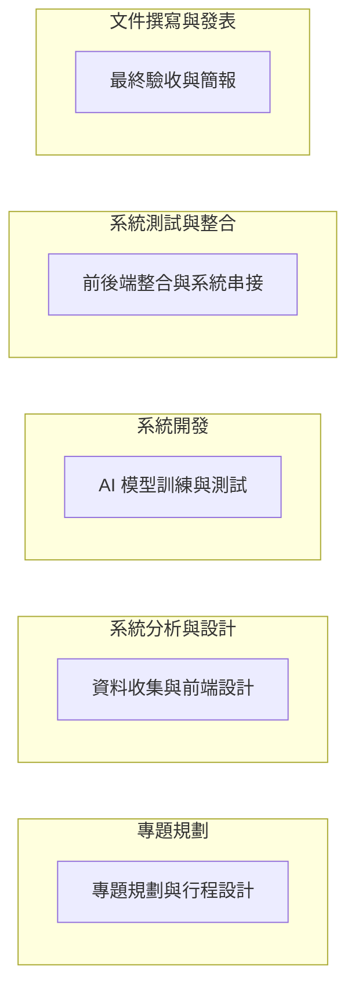

# 小組作業 2：AI 智能貓咪飼料推薦系統專題計畫
📅 專案期間：2025/10/01 ～ 2025/12/21  
👥 小組人數：3（前端、後端）  

---

## 1. 小組成員與分工
| 成員 | 角色 | 任務內容 |
|------|------|----------|
|張冠宗 A | 後端 | AI訓練及爬蟲 |
|張永杰 B | 後端 | AI訓練及爬蟲 |
|李秉程 C | 前端 | UI/UX設計、頁面切版 |

---

## 2. 工作分解結構 (WBS)
| 編號 | 任務說明 | 需時 (天) | 前置任務 | 負責成員 |
|------|----------|-----------|-----------|----------|
| 1 | 專題規劃與行程設計 | 9 | - | 全員 |
| 2 | 資料收集與前端設計 | 13 | 1 | C |
| 3 | AI 模型訓練與測試 | 31 | 2 | A、B |
| 4 | 前後端整合與系統串接 | 25 | 2 | 全員 |
| 5 | 最終驗收與簡報 | 5 | 9,10 | 全員 |

---

## 3. 甘特圖

專題規劃與行程設計 | 9 | - | 全員 |
| 2 | 資料收集與前端設計 | 13 | 1 | C |
| 3 | AI 模型訓練與測試 | 31 | 2 | A、B |
| 4 | 前後端整合與系統串接 | 25 | 2 | 全員 |
| 5 | 最終驗收與簡報 | 5 | 9,10 | 全員 |

## 4. PERT/CPM 圖

