# 小組作業 2：AI 智能貓咪飼料推薦系統專題計畫
📅 專案期間：2025/10/01 ～ 2025/12/21  
👥 小組人數：3（前端、後端）  

---

## 1. 小組成員與分工
| 成員 | 角色 | 任務內容 |
|------|------|----------|
|張冠宗 A | 後端 | AI訓練及爬蟲 |
|張永杰 B | 後端 | AI訓練及爬蟲 |
|李秉程 C | 前端 | UI/UX設計、頁面切版 |

---

## 2. 工作分解結構 (WBS)
| 編號 | 任務說明 | 需時 (天) | 前置任務 | 負責成員 |
|------|----------|-----------|-----------|----------|
| 1 | 專題規劃與行程設計 | 9 | - | 全員 |
| 2 | 資料收集與前端設計 | 13 | 1 | C |
| 3 | AI 模型訓練與測試 | 31 | 2 | A、B |
| 4 | 前後端整合與系統串接 | 25 | 2 | 全員 |
| 5 | 最終驗收與簡報 | 5 | 9,10 | 全員 |

---

## 3. PERT/CPM 圖

```mermaid
graph TD
    1[研擬計畫] --> 2[需求分析與文獻探討]
    2 --> 3[系統功能與資料庫設計]
    2 --> 4[收集/清理旅遊數據]
    3 --> 5[前端雛型設計]
    3 --> 6[後端架構建置]
    4 --> 7[建立推薦模型]
    5 --> 8[Google Maps / AR 串接]
    6 --> 8
    6 --> 9[系統整合與測試]
    7 --> 9
    8 --> 9
    9 --> 10[撰寫使用手冊]
    9 --> 11[最終驗收與簡報]
    10 --> 11
```

---
## 4. 甘特圖 

```mermaid
gantt
    title 智慧旅遊專題甘特圖
    dateFormat  YYYY-MM-DD
    axisFormat  %m/%d

    section 規劃階段
    研擬計畫(全員)           :a1, 2025-10-01, 5d
    需求分析與文獻探討(全員) :a2, after a1, 7d

    section 後端 (B)
    系統功能與資料庫設計(B)   :a3, after a2, 10d
    後端架構建置(B)           :a6, after a3, 15d

    section 資料分析 (C)
    收集/清理旅遊數據(C)      :a4, after a2, 14d
    建立推薦模型(C)          :a7, after a4, 14d

    section 前端 (A)
    前端雛型設計(A)          :a5, after a3, 12d
    Google Maps/AR串接(A,B)  :a8, after a5, 10d

    section 測試與交付 (全員)
    系統整合與測試(全員)     :a9, after a6, 14d
    撰寫使用手冊(A)          :a10, after a9, 7d
    最終驗收與簡報(全員)     :a11, after a10, 5d

```

---

